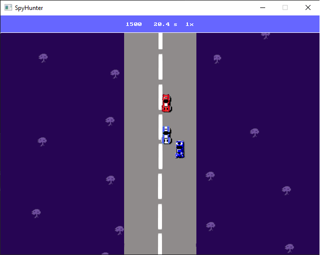

# 🕵️ SpyHunter

> A simple single-player arcade game inspired by the classic **Spy Hunter**, written in **C++** using the **SDL2 (Simple DirectMedia Layer)** library.  
> Developed as a programming fundamentals project.

---

## 🎮 Gameplay Preview

> _Below: screenshot from the actual game_

---

## 🚗 Features

- 🏁 **Arcade-style driving mechanics**: acceleration, braking, lives and collision detection
- 💥 **Score system**: earn points while dodging or destroying enemies
- 🧠 **Basic AI**: enemy vehicles attempt to block and push the player off the road
- 🎨 **Custom graphics**: background was made in **GIMP**
- 🚘 **Two types of vehicles**: NPC cars and hostile enemies with behavior patterns

---

## 🧪 Technologies

- **Language:** C++
- **Graphics Library:** SDL2  
  _[Simple DirectMedia Layer](https://www.libsdl.org/) is a cross-platform development library designed to provide low level access to audio, keyboard, mouse, joystick, and graphics hardware._
- **Image Editor:** GIMP

---

## 🎮 Controls

| Key              | Action      |
|------------------|-------------|
| ⬆️ Arrow Up      | Accelerate  |
| ⬇️ Arrow Down    | Brake       |
| ⬅️ Arrow Left    | Turn Left   |
| ➡️ Arrow Right   | Turn Right  |
| ⏸️ P             | Pause       |
| 💾 S             | Save        |
| ❌ Esc           | Quit        |

---

## 🛠 How to Build and Run the Project

1. **Install SDL2**:
   - Download SDL2 from the official website: [SDL2 Download Page](https://www.libsdl.org/download-2.0.php)
   - Extract the SDL2 folder to your project directory.

2. **Configure the Project**:
   - Open the project in Visual Studio (or any C++ IDE).
   - Set up the include and lib directories for SDL2 in the project settings.

3. **Build the Project**:
   - Compile the project by pressing **Ctrl + Shift + B** in Visual Studio or using `g++` if using a different IDE.

4. **Run the Project**:
   - After building, press **Ctrl + F5** to run the game.
   - Ensure that the **SDL2.dll** is in the same folder as your `.exe`.

---
